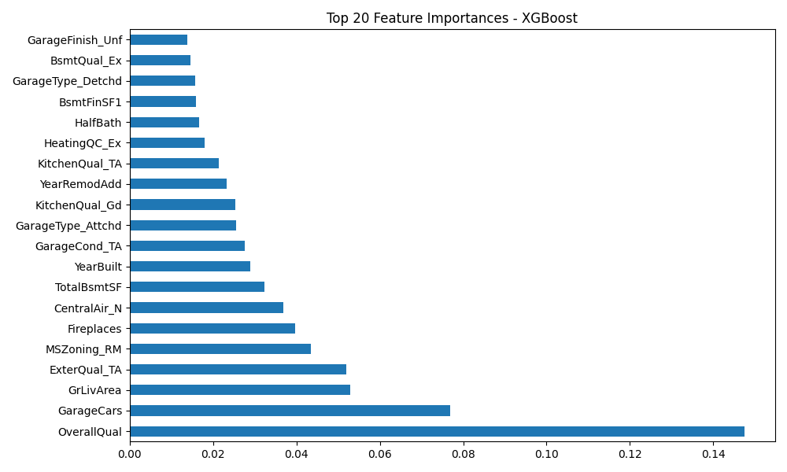
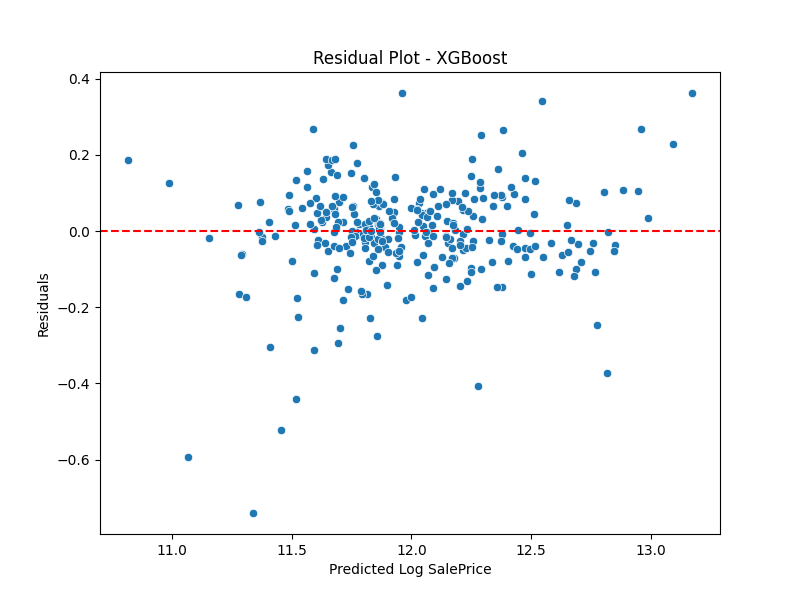
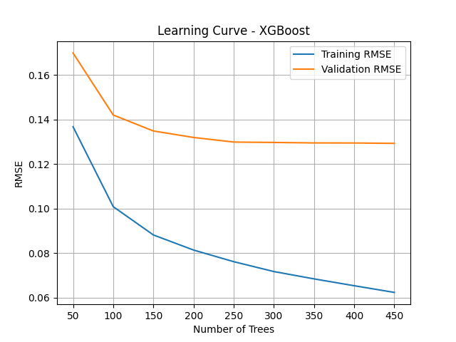

# 🏠 House Price Prediction with Machine Learning

This project is focused on predicting house prices using various regression models. It was developed as a solution for the Kaggle competition: [House Prices - Advanced Regression Techniques](https://www.kaggle.com/competitions/house-prices-advanced-regression-techniques).

## 🚀 Project Overview

We built a machine learning pipeline to process data, train models, evaluate performance, and generate predictions for submission. The target variable is the sale price of houses, and the goal is to minimize the RMSE (Root Mean Squared Error) between predicted and actual values.

## 📊 Models Used

- **Lasso Regression**
- **Random Forest Regressor**
- **XGBoost Regressor** ✅ Best Performance

## 📈 Results

| Model               | RMSE    |
|--------------------|---------|
| Lasso Regression   | 0.1383  |
| Random Forest      | 0.1462  |
| XGBoost Regressor  | 0.1292 ✅ |

The XGBoost model was the most accurate and was used to generate the final predictions.

## 🔧 Tools & Libraries

- Python
- Pandas & NumPy
- Scikit-learn
- XGBoost
- Seaborn & Matplotlib
- Joblib

## 📦 Requirements & Installation

Before running the project, install the required dependencies using the following command:

```bash
pip install -r requirements.txt
```

Ensure you have Python 3.8 or later installed.

## 🛠 Workflow

1. **Load Data**
2. **Data Preprocessing**
   - Combine train/test datasets
   - One-hot encoding for categorical features
   - Missing value imputation using mean strategy
3. **Model Training & Validation**
   - Models trained using 80/20 train-validation split
4. **Model Evaluation**
   - RMSE calculated on validation set
   - Learning curve plotted for XGBoost
5. **Feature Importance & Residual Analysis**
6. **Submission File Generation**
7. **Model Saving & Loading for Reuse**

## 📸 Screenshots

### 📊 Feature Importance (XGBoost)


### 📉 Residual Plot


### 📚 Learning Curve



## 🏁 Final Submission

The final predictions were submitted on Kaggle and scored a **Public Score: 0.13012**, confirming the effectiveness of the XGBoost model.

## 📂 Directory Structure

```
 House-Price-Prediction/
│
├── submission.csv           # Final predictions for Kaggle
├── house_prediction_model.pkl  # Trained model file
├── requirements.txt         # Required Python packages
├── screenshots/             # Folder for plots 
│   ├── importance.png
│   ├── residual.png
│   └── learning_curve.png
└── README.md                # Project description
```

## 🏆 Kaggle Submission

- A public score of **0.13012** was achieved using the XGBoost model.
- Earned the **Getting Started Competitor** badge on Kaggle ✅

## 👨‍💻 Author

**Houssem Bouagal**  
📧 mouhamedhoussem813@gmail.com

---
🔗 Made with 💡 and ML passion.
